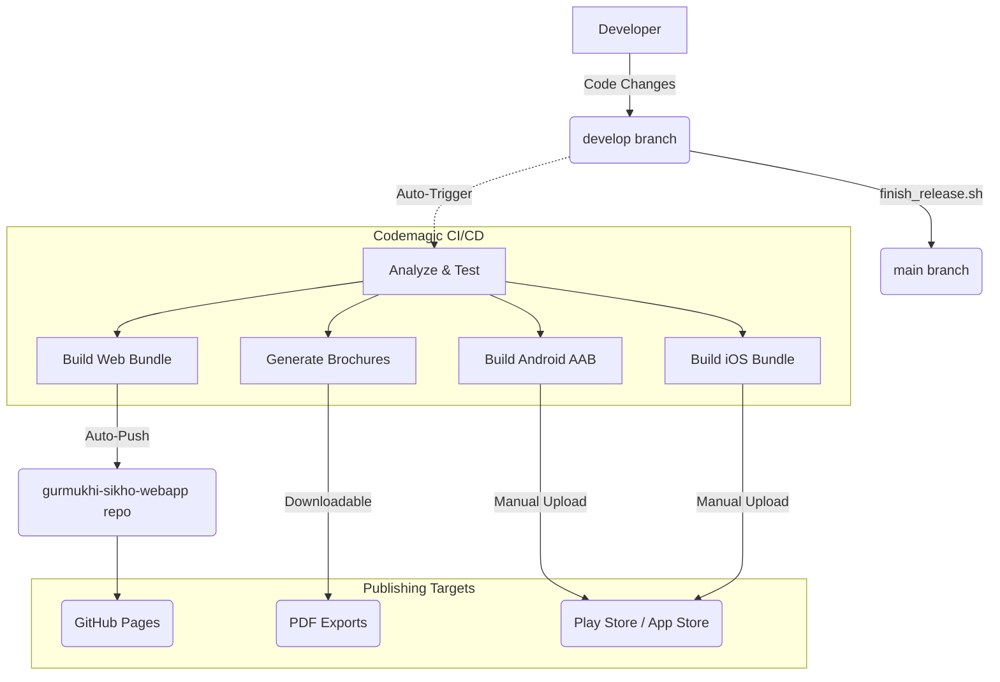

# Build and Release Workflow

This document visualizes the end-to-end development, verification, and deployment pipeline for **Gurmukhi Sikho**.

## High-Level Architecture

## Component Breakdown

### 1. Verification Phase
Before any build is finalized, the system runs an automated suite to ensure stability:
- **Analyze & Test**: Logic validation and code quality checks.
- **Curriculum Integrity**: Scans all JSON data to ensure puzzles are solvable and audio exists.
- **Emoji Audit**: Verifies every word matches the `emoji_reference.json` source of truth.

### 2. Output & Artifacts
The CI pipeline produces three types of output:
- **Web App**: Automatically built and force-pushed to the dedicated [gurmukhi-sikho-webapp](https://github.com/gnps-developer/gurmukhi-sikho-webapp) repository for instant live hosting.
- **Brochures**: High-fidelity PDF exports generated automatically for curriculum reference.
- **Mobile Bundles**: Signed Android AABs and native iOS bundles ready for distribution.

### 3. Manual Release & Finalization
- **Manual Upload**: Android and iOS binaries are downloaded from Codemagic and manually uploaded to the Google Play and Apple App consoles.
- **`prepare_release.sh`**: Used by the developer to run a deep integrity check and create version tags before a store update.
- **`finish_release.sh`**: Merges the verified code from `develop` into `main` to establish the new production baseline.

---

> [!NOTE]
> The **Web App** updates automatically on every push, while **Mobile Stores** are updated manually using the Codemagic artifacts.
